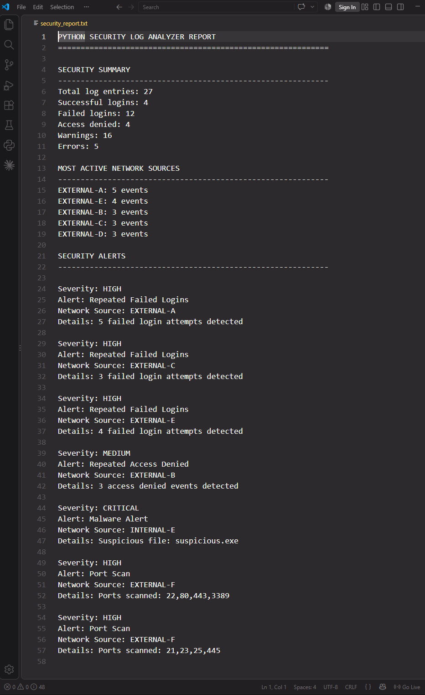

# 🔐 Python Security Log Analyzer

A Python cybersecurity project that analyses simulated security logs, identifies suspicious activity and automatically generates a security analysis report.

The project demonstrates practical Python programming, log parsing and basic rule-based security monitoring.

---

## 📌 Project Overview

Security teams analyse system and authentication logs to identify unusual or potentially suspicious activity.

This project reads a simulated security log file, extracts useful information from each event and applies simple detection rules to identify activity such as:

- Repeated failed login attempts
- Repeated access-denied events
- Malware alert events
- Port-scan events
- High levels of activity from individual network sources

The results are displayed in the terminal and also written to an automatically generated security report.

---

## 🔒 Sample Data Notice

All logs, usernames, network information and security events used in this project are **simulated for educational and portfolio purposes**.

This project does not contain:

- Real customer information
- Real production logs
- Passwords or credentials
- Private company information
- Real security incidents
- Real attacker information

Network addresses are deliberately omitted or masked in this README.

---

## ✨ Features

- Reads security log files
- Parses individual log entries
- Counts successful login events
- Counts failed login attempts
- Tracks warnings and errors
- Tracks network-source activity
- Detects repeated failed logins
- Detects repeated access-denied activity
- Recognises malware alerts
- Recognises port-scan events
- Assigns alert severity levels
- Displays analysis in the terminal
- Automatically generates a security report
- Handles missing files safely

---

## 🚨 Security Alert Levels

| Security Event | Severity |
|---|---|
| Repeated failed login attempts | HIGH |
| Repeated access-denied events | MEDIUM |
| Malware alert | CRITICAL |
| Port-scan activity | HIGH |

The failed-login threshold is currently:

```python
FAILED_LOGIN_THRESHOLD = 3
```

This means three or more failed login attempts from the same source will trigger a **HIGH** severity alert.

---

## 📊 Example Analysis

Using the included simulated security log, the analyzer produced:

```text
Total log entries: 27
Successful logins: 4
Failed logins: 12
Access denied: 4
Warnings: 16
Errors: 5
```

### Most Active Sources

```text
Source A    5 events
Source B    4 events
Source C    3 events
Source D    3 events
Source E    3 events
```

No real network addresses are displayed in the documentation.

---

## 🚨 Example Security Alerts

```text
[HIGH] Repeated Failed Logins
Source: Masked
Details: 5 failed login attempts detected
```

```text
[MEDIUM] Repeated Access Denied
Source: Masked
Details: 3 access denied events detected
```

```text
[CRITICAL] Malware Alert
Source: Masked
Details: Suspicious file event detected
```

```text
[HIGH] Port Scan
Source: Masked
Details: Multiple ports scanned
```

---

## 🛠️ Technologies Used

- **Python 3**
- **pathlib**
- **collections.Counter**
- File handling
- Dictionaries
- Lists
- Functions
- Loops
- Conditional logic
- Exception handling
- String parsing
- Git
- GitHub
- Visual Studio Code

No external Python packages are required.

---

## 📁 Project Structure

```text
python-security-log-analyzer/
│
├── log_analyzer.py
│
├── sample_logs/
│   └── security.log
│
├── reports/
│   └── security_report.txt
│
└── README.md
```

---

## 🔄 How the Program Works

```text
Simulated Security Log
        ↓
Read Log Entries
        ↓
Parse Each Line
        ↓
Extract Event Information
        ↓
Identify Severity / Event / Source
        ↓
Count Security Activity
        ↓
Apply Detection Rules
        ↓
Create Security Alerts
        ↓
Display Terminal Results
        ↓
Generate Security Report
```

---

## 🧠 Log Parsing

A simulated log entry may contain information such as:

```text
2026-10-03 08:14:02 WARNING LOGIN_FAILED user=admin source=MASKED
```

The Python program converts the information into structured data similar to:

```python
{
    "timestamp": "2026-10-03 08:14:02",
    "severity": "WARNING",
    "event": "LOGIN_FAILED",
    "data": {
        "user": "admin",
        "source": "MASKED"
    }
}
```

Structuring the information makes it easier to count events and apply detection rules.

---

## 🔍 Failed Login Detection

The program counts failed login attempts from individual network sources.

Example logic:

```python
if event == "LOGIN_FAILED" and ip_address:
    failed_login_counter[ip_address] += 1
```

If the number of failed attempts reaches the configured threshold, the program creates a security alert.

This demonstrates a simple rule-based security-monitoring approach.

---

## 🦠 Malware Detection

The analyzer recognises simulated malware alert events and assigns them a:

```text
CRITICAL
```

severity level.

Example:

```text
[CRITICAL] Malware Alert
Details: Suspicious file event detected
```

---

## 🔎 Port Scan Detection

The analyzer can also recognise simulated port-scan events.

Example:

```text
[HIGH] Port Scan
Details: Multiple ports scanned
```

This demonstrates how security logs can be processed to identify potentially suspicious network behaviour.

---

## 📄 Generated Security Report

After the analysis finishes, the program automatically creates:

```text
reports/security_report.txt
```

The report contains:

- Total log entries
- Successful login count
- Failed login count
- Access-denied count
- Warning count
- Error count
- Most active network sources
- Detected security alerts
- Alert severity
- Alert details

---

## ▶️ Running the Project

Clone the repository:

```bash
git clone https://github.com/Cloud9din/python-security-log-analyzer.git
```

Open the project directory:

```bash
cd python-security-log-analyzer
```

Run the analyzer:

```bash
python log_analyzer.py
```

On Windows you can also use:

```bash
py log_analyzer.py
```

The analysis will appear in the terminal and a security report will be generated automatically.

---

## 💻 Example Terminal Output

```text
============================================================
        PYTHON SECURITY LOG ANALYZER
============================================================

SECURITY SUMMARY
------------------------------------------------------------
Total log entries: 27
Successful logins: 4
Failed logins: 12
Access denied: 4
Warnings: 16
Errors: 5

SECURITY ALERTS
------------------------------------------------------------

[HIGH] Repeated Failed Logins
Source: Masked
Details: Multiple failed login attempts detected

[MEDIUM] Repeated Access Denied
Source: Masked
Details: Repeated access-denied events detected

[CRITICAL] Malware Alert
Source: Masked
Details: Suspicious file event detected

[HIGH] Port Scan
Source: Masked
Details: Multiple ports scanned
```

---

## 📸 Screenshot

### Security Analyzer Running in VS Code


---

## 🧠 Python Concepts Demonstrated

This project demonstrates:

- Variables
- Constants
- Functions
- Dictionaries
- Lists
- Loops
- Conditional statements
- File handling
- Exception handling
- `Counter`
- `pathlib`
- String parsing
- Data aggregation
- Detection rules
- Automated report generation

---

## 🛡️ Cybersecurity Concepts Demonstrated

The project demonstrates basic understanding of:

- Security log analysis
- Authentication monitoring
- Failed-login detection
- Suspicious network activity
- Access-control events
- Malware alerts
- Port scanning
- Alert severity classification
- Security reporting

This is an educational portfolio project rather than a production security-monitoring system.

---

## 🎯 What I Learned

Building this project helped me improve my understanding of:

- Reading security logs with Python
- Converting raw logs into structured data
- Tracking repeated events
- Identifying suspicious activity
- Creating simple detection rules
- Classifying security alerts
- Generating automated reports
- Running Python applications in Visual Studio Code
- Using Git and GitHub for version control

---

## 🔮 Future Improvements

Possible future improvements include:

- Command-line arguments
- Coloured terminal output
- Time-based brute-force detection
- Date and time filtering
- CSV report export
- JSON report export
- Configurable detection rules
- Source allowlists and blocklists
- Security charts
- Real-time log monitoring
- Web-based SOC dashboard
- SIEM-style event dashboard

---

## 📌 Project Status

**Working Version**

- Log file reading ✅
- Log parsing ✅
- Successful-login counting ✅
- Failed-login detection ✅
- Access-denied detection ✅
- Malware-alert recognition ✅
- Port-scan recognition ✅
- Network activity tracking ✅
- Severity classification ✅
- Terminal reporting ✅
- Automatic report generation ✅

---

⭐ This project was created for educational and portfolio purposes using simulated security data.
